# Architecture Documentation

This document describes the architectural decisions, design patterns, and execution model of the **JapaneseStudent** backend system.

**Related Documentation**: [Services](./SERVICES.md) | [API](./API.md) | [Configuration](./CONFIGURATION.md) | [Libraries](./LIBS.md) | [Running](./RUNNING.md)

---

## High-Level Design

The system is composed of multiple Go services communicating over HTTP and asynchronous task queues.

**Core Principles**:
- Clear separation of concerns
- Database as the source of truth
- Asynchronous execution for non-blocking workflows
- Fail-safe design with automatic retries

**Technical Constraints**:
- **Language**: Go 1.22+ for all services
- **Database**: MariaDB 10.11+ (MySQL-compatible relational database)
- **Queue**: Redis 7+ with Asynq for task processing
- **Deployment**: Docker containers orchestrated via Docker Compose
- **Communication**: HTTP REST APIs between services
- **Authentication**: JWT-based (access + refresh tokens)

---

## System Context

```mermaid
graph TB
    User[👤 End User]
    Admin[👤 Admin]
    Tutor[👤 Tutor]
    System[JapaneseStudent Backend]
    SMTP[📧 SMTP Server]
    
    User -->|HTTPS| System
    Admin -->|HTTPS| System
    Tutor -->|HTTPS| System
    System -->|SMTP| SMTP
```



**Actors**: End users (learn Japanese), Admins (manage system), Tutors (create content)  
**External Systems**: SMTP server for email delivery

---

## Container Architecture

```mermaid
graph TB
    Client[Web/Mobile Client]
    
    subgraph "JapaneseStudent System"
        Auth[🔐 auth-service:8081]
        Learn[📚 learn-service:8080]
        Media[📁 media-service:8082]
        TaskAPI[⚙️ task-api:8083]
        TaskScheduler[⏰ task-scheduler]
        TaskWorker[🔧 task-worker]
        MariaDB[(💾 MariaDB)]
        Redis[(📦 Redis)]
    end
    
    SMTP[📧 SMTP Server]
    
    Client --> Auth & Learn & Media & TaskAPI
    Auth --> Media & TaskAPI & Learn
    Learn --> Media
    TaskAPI --> Learn
    
    Auth & Learn & Media & TaskAPI & TaskScheduler & TaskWorker --> MariaDB
    TaskAPI & TaskScheduler & TaskWorker --> Redis
    TaskWorker --> SMTP
```



**Service Details**: See [SERVICES.md](./SERVICES.md) for detailed responsibilities, features, and integration points of each service.

**Infrastructure**:
- **MariaDB**: Primary persistent storage for all business data
- **Redis**: Task queue and scheduling (ZSET for cron)

---

## Service Internal Structure

All services follow a consistent layered architecture:

```
service-name/
├── cmd/                    # Entry point
├── internal/
│   ├── handlers/          # HTTP handlers
│   ├── services/          # Business logic
│   ├── repositories/      # Data access
│   ├── models/            # Domain models
│   └── middleware/        # Service-specific middleware
├── migrations/            # Database schema migrations
└── test/                  # Integration tests
```

**Shared Libraries**: See [LIBS.md](./LIBS.md) for details about `libs/` directory and shared infrastructure code.

---

## Data Flow & Interaction Patterns

### Key Patterns

1. **Request-Response (Synchronous)**
   - HTTP APIs return immediately after database operations
   - Background work is enqueued, not executed synchronously

2. **Asynchronous Task Processing**
   - Tasks enqueued to Redis
   - Workers process tasks independently
   - Execution logged for observability

3. **Database as Source of Truth**
   - Tasks contain identifiers only (userId, taskId, URL)
   - Workers load full data from MariaDB at execution time
   - Ensures data consistency and recoverability

4. **Idempotent Operations**
   - Scheduled tasks check for duplicates (userId + URL)
   - Task execution logged for manual recovery
   - Retries are safe due to idempotent design

### Example Flows

**Authentication**: Client → auth-service → MariaDB (create user) → task-api (enqueue email) → worker → SMTP

**Learning Test**: Client → learn-service → MariaDB (query history, update scores)

**Scheduled Task**: Scheduler → MariaDB (query due tasks) → Redis (enqueue) → Worker → MariaDB (load task) → HTTP webhook → MariaDB (log result)

---

## Deployment & Infrastructure

**Orchestration**: Docker Compose with bridge network (`japanesestudent-network`)

**Persistence**:
- **MariaDB**: Persistent volume for database files
- **Media Files**: Persistent volume for uploaded files
- **Redis**: Persistent volume with AOF for durability

**Scaling** (Current: Single Instance):
- Future: Multiple worker instances, database read replicas, object storage for media

**Configuration**: Environment-driven (see [CONFIGURATION.md](./CONFIGURATION.md))

**Running Locally**: See [RUNNING.md](./RUNNING.md) for setup and execution instructions.

---

## Quality Attributes

### Performance
- API response: < 200ms (p95) read, < 500ms (p95) write
- Strategies: Database indexes, connection pooling, async processing

### Reliability
- Targets: 99.9% availability, 99.9% task success rate
- Strategies: Automatic retries (exponential backoff), durable storage, execution logging

### Security
- JWT authentication (access + refresh tokens)
- Password hashing (bcrypt/argon2)
- API key authentication for inter-service communication
- Input validation and SQL parameterization

### Observability
- Structured logging (JSON) to stdout
- Request ID tracking
- Task execution logs in database

---

## Technology Stack

**Language**: Go 1.22+

**Databases**: MariaDB 10.11+, Redis 7+

**Key Libraries**:
- HTTP: `net/http`, `go-chi/chi`
- Database: `database/sql`, `golang-migrate/migrate`
- Tasks: `hibiken/asynq`
- Auth: `golang-jwt/jwt`, `golang.org/x/crypto`
- Logging: `go.uber.org/zap`

**Infrastructure**: Docker, Docker Compose, SMTP

---

## Architecture Decision Records

Key architectural decisions:

1. **Microservices Architecture**: Independent services for clear separation
2. **Database as Source of Truth**: MariaDB for all business data; Redis only for queues
3. **Task Queue Design**: Tasks contain identifiers only; data loaded at execution
4. **Shared Libraries**: `libs/` contains only infrastructure code, no business logic
5. **JWT Authentication**: Stateless access tokens + stateful refresh tokens
6. **Go Language**: Performance, concurrency, simplicity

---

**Document Status**: Living document - updated as architecture evolves
